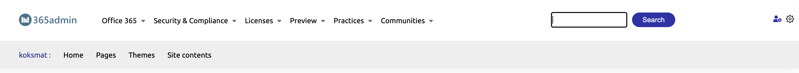

This is the script need for applying branding to SharePoint Online tenant. The branding  packages can be controlled per site or hub site and you get the ability to setup a custom logo pr configuration, usefull in e.g. multi brand scenarios. 

## Prerequisites

- You need to have a SharePoint Online tenant
- You need to have access to the Global Admin of your tenant
- Optional: You need to consult the SharePoint responsible within your organisation

## 365admin ready

This packages is 365admin ready. This means that you can install the package in your tenant and be sure that there has been made a proper peer review of the code.

## What is 365admin?

365admin is a platform which makes life easier for Administrators. 

[ ] todo: add link to 365admin website - https://365adm.in

